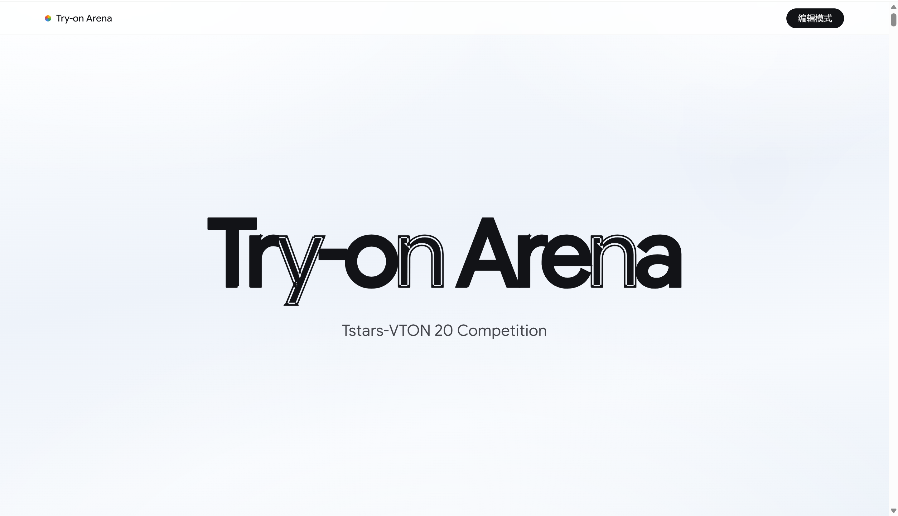
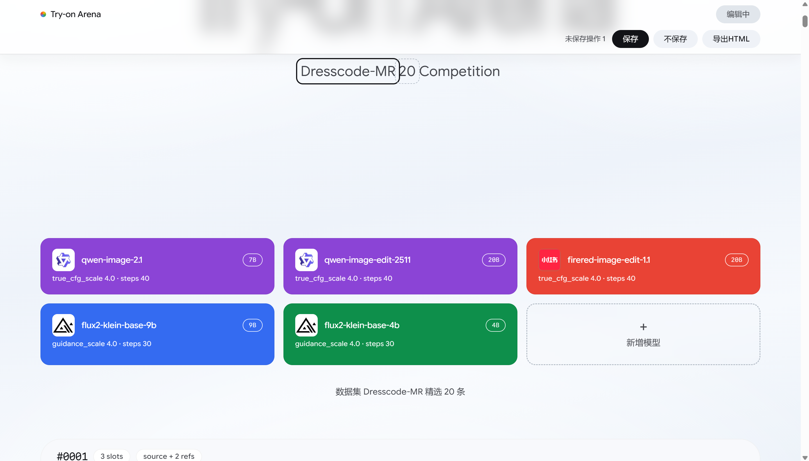
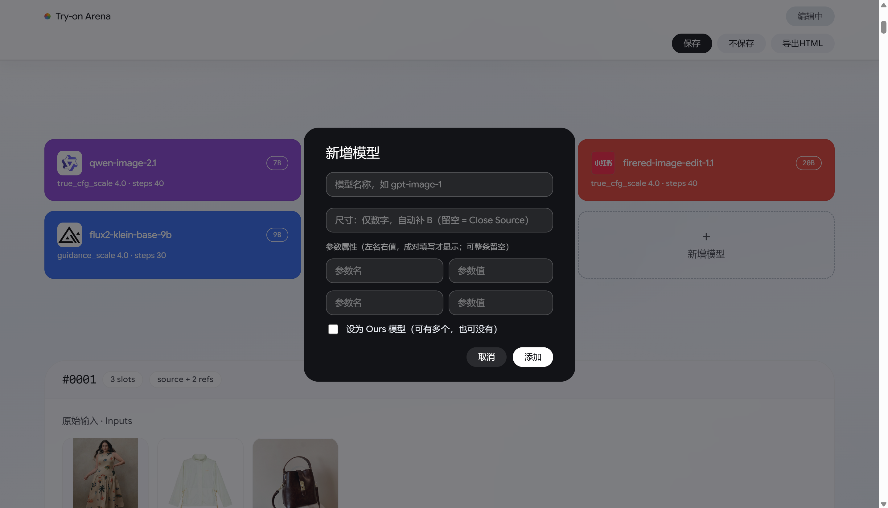
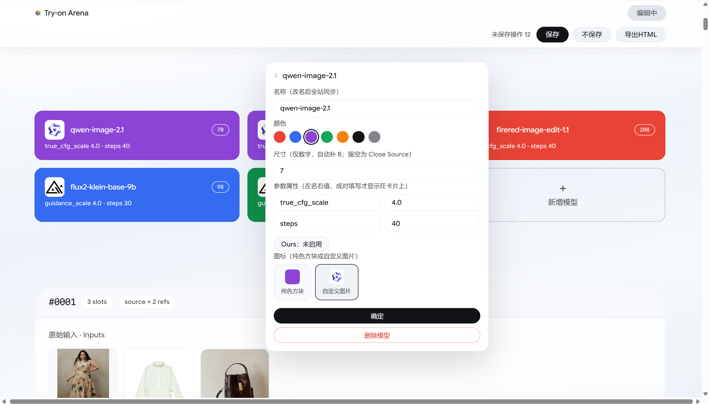
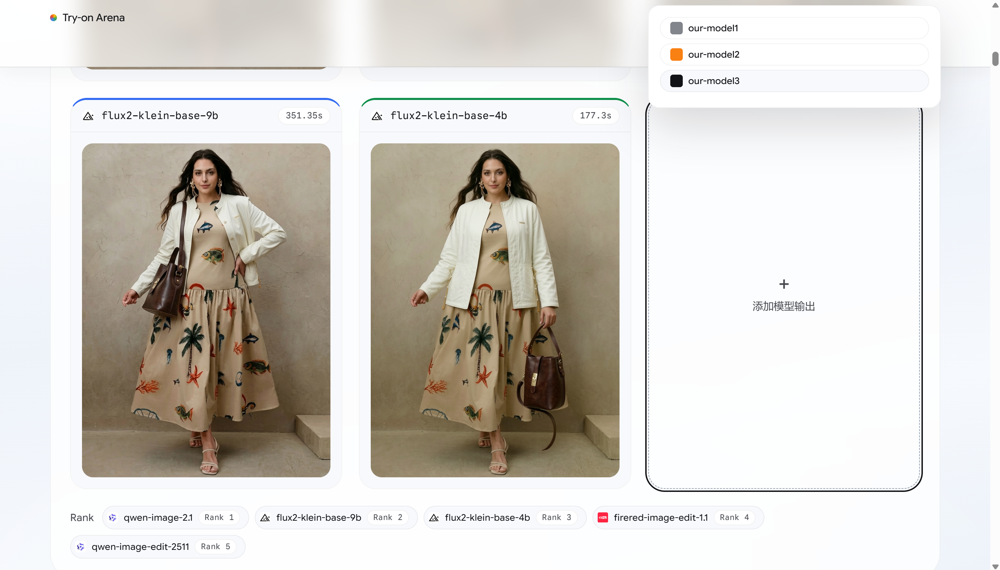
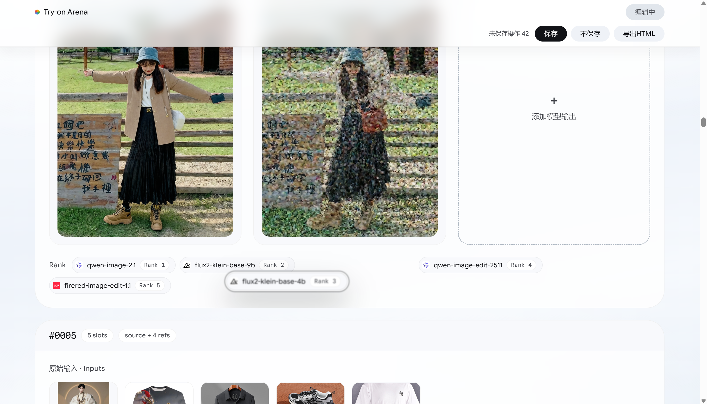
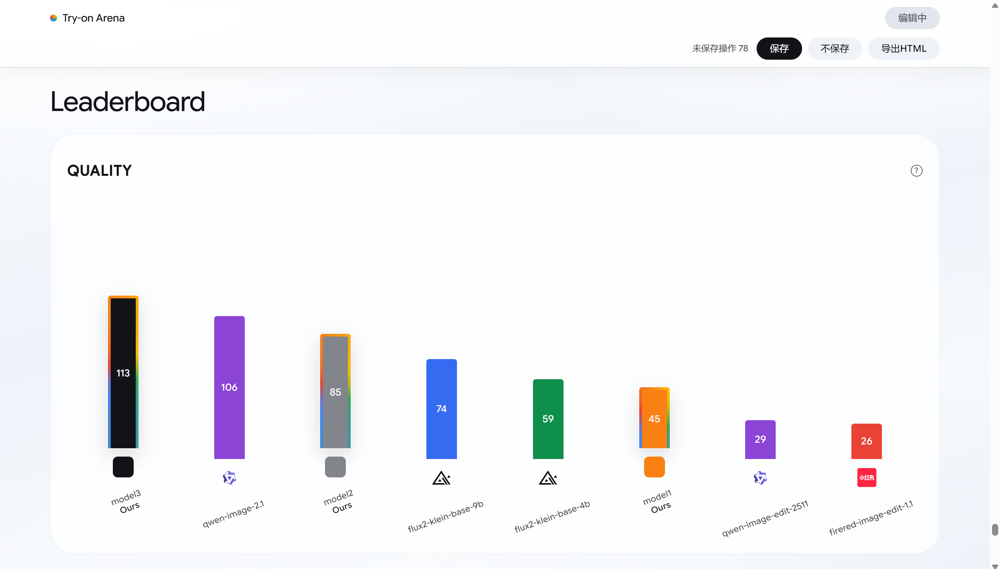
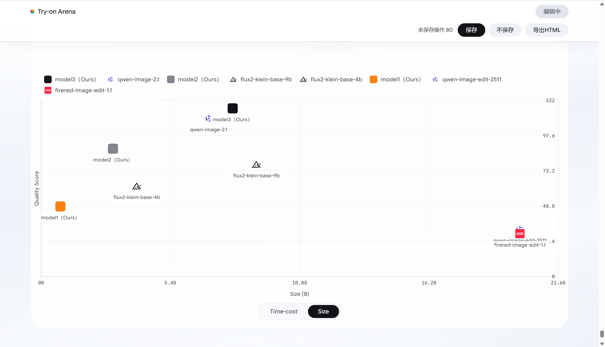

# Try-on Arena

多参考图虚拟试穿（Multi-Reference Virtual Try-On）的人类偏好评测竞技场。

给定同一张 source 人物图与若干件服装/配饰参考图及一条编辑指令，横向对比各开源/闭源模型的推理输出。

- 样本：暂时 15 例（持续补充中）
- 参评模型：qwen-image-2.1、qwen-image-edit-2511、flux2-klein-base-9b、flux2-klein-base-4b、firered-image-edit-1.1（持续更新中）
- 榜单：质量分、耗时、以及质量 × 耗时/参数量的散点分布

## 访问

<https://myosotissino.github.io/MR-VTON/>

## 正式版编辑模式功能展示

以下为**正式版编辑模式**的功能，发布到 Pages 的为预览版，暂不含编辑入口。

更多功能持续开发中...

## 说明

- 发布版本暂时只是**只读**的静态预览版，页面内暂不提供任何编辑入口，内容不可被访问者修改，后续预计将开源可编辑正式版。
- 为控制体积，`assets/` 下的图片是面向 Web 投递的**缩小重压副本**（长边 900px，WebP），不是原始分辨率文件；页面中标注的分辨率描述的是模型那次推理的真实输出尺寸。
- 提示词为数据集 `caption.txt` 原文，未做改写。
- 本仓库暂不公开数据集、权重与推理代码。
